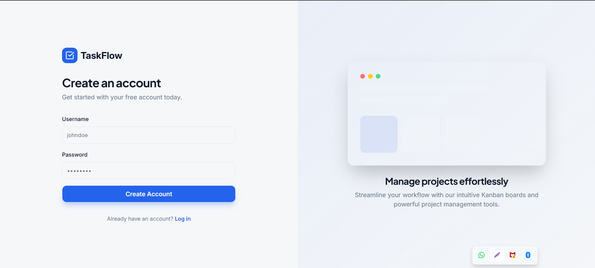
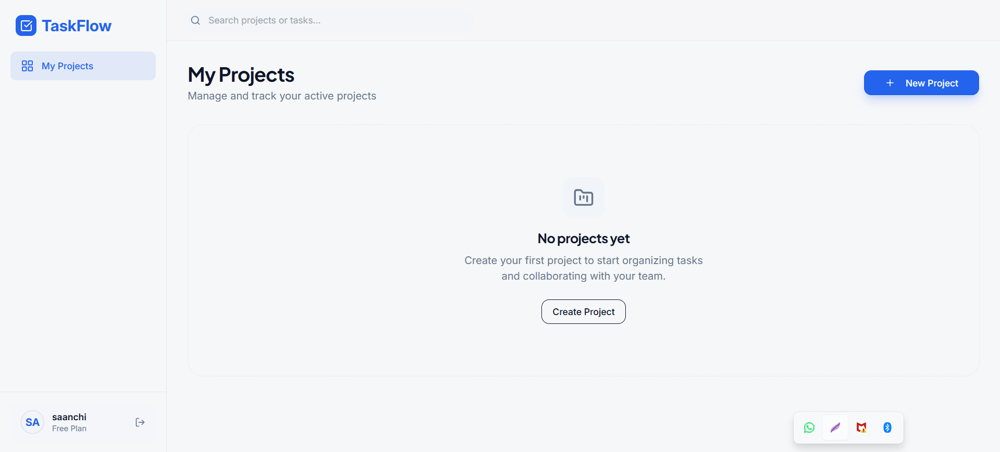
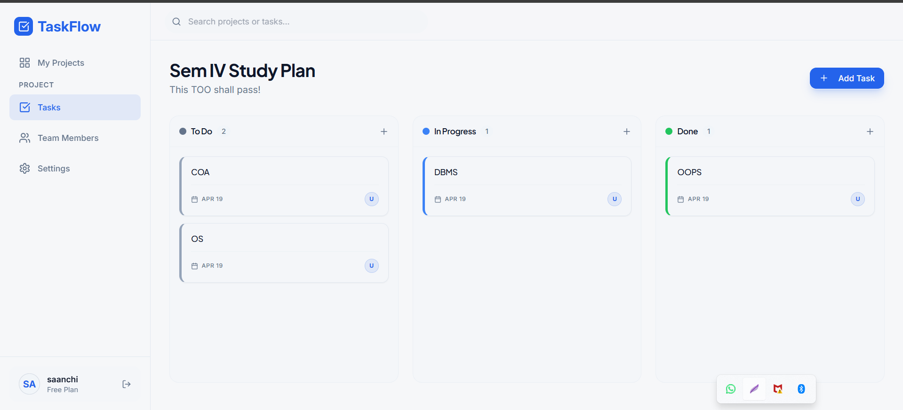

# TaskFlow (Task Maestro)

TaskFlow is a full-stack project and task management app with authentication, project-level collaboration, and a Kanban-style workflow.

## UI Preview

### Login Page
<p align="center">
  
</p>

### Landing Page
<p align="center">
  
</p>

### User Dashboard
<p align="center">
  
</p>

## What this project includes

### Core product features

1. User registration and login with JWT.
2. Protected routes and authenticated API access.
3. Project creation, listing, and update.
4. Project member management (owner can add members).
5. Task CRUD inside a project.
6. Kanban status flow (`todo` → `in_progress` → `done`) with drag/drop UI.
7. Health check endpoint for service monitoring.
8. Auto-seeding demo data on first backend start when `demo` user is missing.

## Architecture

### High-level architecture

- **Frontend**: React + Vite SPA (`frontend/`).
- **Backend**: Express API (`backend/`).
- **Data layer**: MongoDB via Mongoose models.
- **Shared contracts**: Each app has its own `shared/` folder (`routes.ts`, `schema.ts`) with Zod-based types/contracts.

### Request/data flow

1. User interacts with React pages/components.
2. Hooks (`use-auth`, `use-projects`, `use-tasks`) call API helpers.
3. API requests go to `/api/*` endpoints (proxied by Vite in local dev to `http://localhost:5001`).
4. Express routes validate payloads with shared Zod schemas.
5. Route handlers call `storage` (Mongo-backed implementation).
6. Storage uses Mongoose models to read/write MongoDB.
7. JSON response returns to frontend and updates TanStack Query cache.

## Repository structure

```text
Task-Maestro/
├─ backend/
│  ├─ src/
│  │  ├─ db.ts            # Mongo connection bootstrap
│  │  ├─ index.ts         # Express app/server startup
│  │  ├─ models.ts        # Mongoose schemas/models
│  │  ├─ routes.ts        # API routes (auth/projects/tasks)
│  │  ├─ static.ts        # Static serving placeholder
│  │  └─ storage.ts       # Data access abstraction + Mongo impl
│  ├─ shared/
│  │  ├─ routes.ts        # API contract definitions
│  │  └─ schema.ts        # Zod schemas + TS types
│  ├─ package.json
│  └─ tsconfig.json
├─ frontend/
│  ├─ src/
│  │  ├─ components/
│  │  │  ├─ layout.tsx    # App shell/sidebar/header
│  │  │  └─ ui/*          # shadcn/ui component set
│  │  ├─ hooks/
│  │  │  ├─ use-auth.ts
│  │  │  ├─ use-projects.ts
│  │  │  ├─ use-tasks.ts
│  │  │  ├─ use-mobile.tsx
│  │  │  └─ use-toast.ts
│  │  ├─ lib/
│  │  │  ├─ api.ts
│  │  │  ├─ auth.ts
│  │  │  ├─ queryClient.ts
│  │  │  └─ utils.ts
│  │  ├─ pages/
│  │  │  ├─ auth.tsx
│  │  │  ├─ dashboard.tsx
│  │  │  ├─ project-details.tsx
│  │  │  ├─ project-members.tsx
│  │  │  ├─ project-settings.tsx
│  │  │  └─ not-found.tsx
│  │  ├─ App.tsx
│  │  └─ main.tsx
│  ├─ shared/
│  │  ├─ routes.ts
│  │  └─ schema.ts
│  ├─ package.json
│  ├─ vite.config.ts
│  └─ tsconfig.json
├─ script/
│  └─ build.ts
├─ components.json
└─ readme.md
```

## Tech stack

| Layer | Technologies |
|---|---|
| Frontend framework | React 18, TypeScript, Vite 7 |
| UI system | Tailwind CSS, shadcn/ui (Radix primitives), lucide-react |
| State/data fetching | TanStack Query |
| Forms/validation | React Hook Form, Zod |
| Motion | Framer Motion |
| Routing | Wouter |
| Backend runtime | Node.js, Express 5, TypeScript |
| Auth | JWT (`jsonwebtoken`), bcrypt (`bcryptjs`) |
| Database ODM | Mongoose |
| Database | MongoDB (Atlas-compatible connection string) |

## API surface

### Auth

- `POST /api/auth/register`
- `POST /api/auth/login`
- `GET /api/auth/me`

### Projects

- `GET /api/projects`
- `POST /api/projects`
- `GET /api/projects/:id`
- `PATCH /api/projects/:id`
- `GET /api/projects/:id/members`
- `POST /api/projects/:id/members`

### Tasks

- `GET /api/projects/:projectId/tasks`
- `POST /api/projects/:projectId/tasks`
- `PATCH /api/tasks/:id`
- `DELETE /api/tasks/:id`

### Health

- `GET /health`

## Environment variables

### Backend (`backend/.env`)

- `MONGO_URL` (required)
- `JWT_SECRET` (required)
- `PORT` (optional, defaults to `5000` if not set in code)

### Frontend (`frontend/.env.production`)

- `VITE_API_BASE_URL` (optional; defaults to relative path behavior)

## Database connectivity check

**Status: connected in codebase.**

- Backend startup calls `connectDB()` before route registration.
- `connectDB()` requires `MONGO_URL` and uses `mongoose.connect(...)`.
- Storage implementation uses Mongo-backed Mongoose models for users, projects, tasks, and memberships.
- The local backend environment file contains `MONGO_URL` and related keys, so the app is configured for MongoDB connectivity.

## Local development

### 1. Run backend

```bash
cd backend
npm install
npm run dev
```

Backend default URL: `http://localhost:5001` (if `PORT=5001` in env).

### 2. Run frontend

```bash
cd frontend
npm install
npm run dev
```

Frontend URL: `http://localhost:5173`.

In development, Vite proxies `/api` requests to `http://localhost:5001`.

## Deployment notes

1. Deploy frontend and backend as separate services.
2. Set backend env vars (`MONGO_URL`, `JWT_SECRET`, `PORT`).
3. Set frontend `VITE_API_BASE_URL` to your backend base URL in production.
4. Ensure CORS `origin` list in backend includes your deployed frontend domain.

## License & ownership

© 2026 Aryan Bhardwaj. All Rights Reserved.
